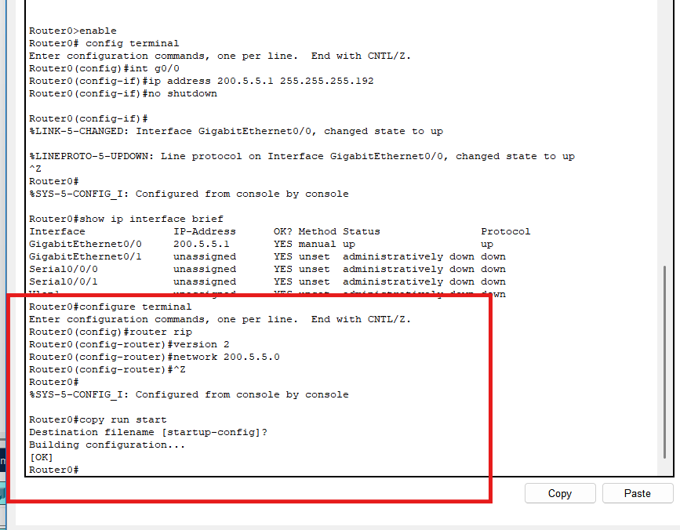
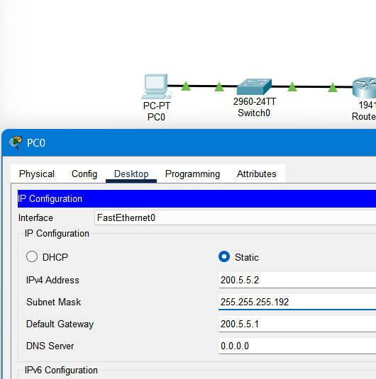
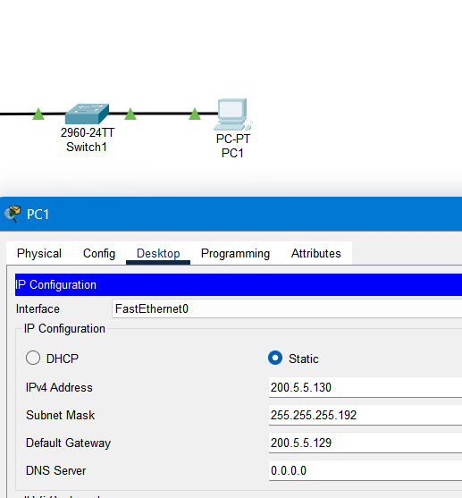
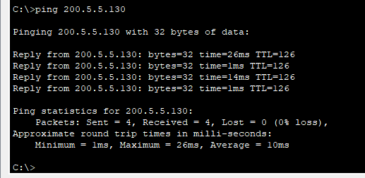

# Network Configuration with RIP Routing – Cisco Packet Tracer

This project demonstrates IP address configuration and RIP routing between two Cisco routers with connected PCs in Packet Tracer.

## 🧠 Objective

To simulate and configure a routed network where:
- Two routers are connected via serial interface
- RIPv2 routing protocol is implemented
- Static IPs are assigned to end devices
- End-to-end connectivity is verified using ping

## 🖥️ Network Topology
We started out with:
- Two routers (`Router0`, `Router1`)
- Two switches (`Switch0`, `Switch1`)
- Two client PCs (`PC0`, `PC1`)

## ⚙️ Configuration Details

### 🔧 Router0 Configuration

- **Entered privileged and global config mode** to allow changes to the router settings.

- **Configured GigabitEthernet0/0** with IP `200.5.5.1/26` and used `no shutdown` to activate the interface. This connects the router to the local network.

- **Used `show ip interface brief`** to verify that the interface was up and running.

- **Enabled RIP version 2 routing**, which supports subnetting and allows the router to dynamically share routing information with other routers.

- **Saved the configuration** using `copy run start` so settings are retained after a reboot.

### 🔧 Router1 Configuration 

- **Configured GigabitEthernet0/0** with IP `200.5.5.129/26` and activated it using `no shutdown` to connect Router1 to its local network.

- **Set IP on Serial0/0/0** to `200.5.5.66/26` for communication with Router0 over the WAN link.

- **Enabled interfaces and verified status** using `show ip interface brief` to confirm IP assignments and link states.

- **Configured RIP version 2** and advertised the `200.5.5.0` network to allow dynamic routing between both routers.

### PC0 (Static Configuration)
- IP Address: `200.5.5.2`
- Subnet Mask: `255.255.255.192`
- Default Gateway: `200.5.5.1`

### PC1 (Static Configuration)
- IP Address: `200.5.5.130`
- Subnet Mask: `255.255.255.192`
- Default Gateway: `200.5.5.129`

## ✅ Connectivity Test

Ping test was run from `PC0` to `PC1` (`200.5.5.130`).

Result:
- All packets successfully received (0% loss)
- Round trip times between 1ms and 26ms

## 💡 Notes

- Ensure serial interfaces have correct DCE/DTE configuration
- Verify RIP version 2 is enabled on both routers
- Check interface status with `show ip interface brief`
- Routing tables can be viewed with `show ip route`

---

## 📁 Files Included

| File | Description |
|------|-------------|
| [Network Config.pkt](./Network%20Config.pkt) | Cisco Packet Tracer file |
| [tt1.png](./tt1.png) → [tt9.png](./tt9.png) | Screenshots of topology, configuration, and verification |
| [README.md](./README.md) | Documentation (this file) |

## 🔗 Author

Anthony Alston  
GitHub: [AnthonyAAlston](https://github.com/AnthonyAAlston)
