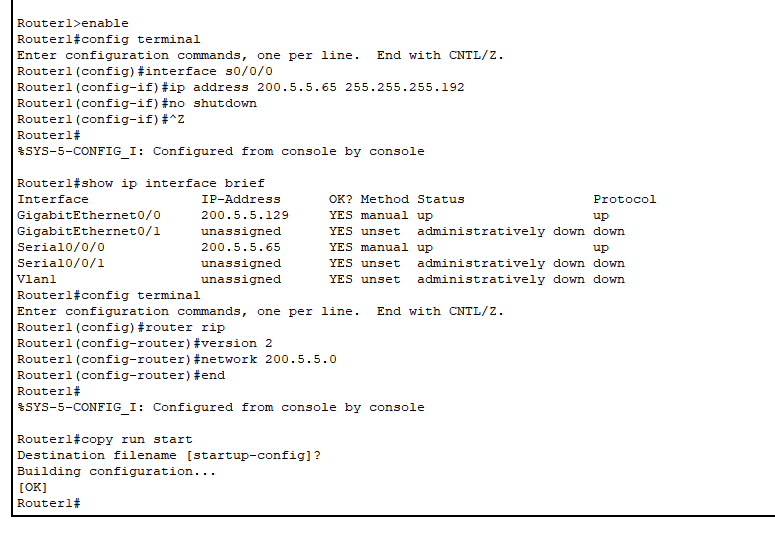
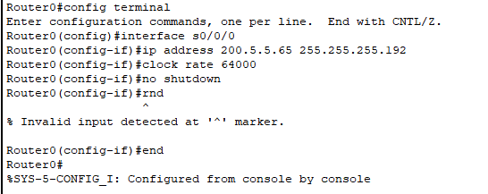

# IP Addressing & Routing — Cisco Packet Tracer

## 📄 Overview
This project demonstrates how to configure static IP addresses and routing protocols in a multi-router network using Cisco Packet Tracer. It includes:
- Assigning static IP addresses to PCs and router interfaces
- Enabling and configuring RIP version 2 for routing
- Verifying connectivity through ping tests

---

## 🖼 Topology

---

## ⚙️ Configuration Details

### 🔹 Router0
- **Interface g0/0**: `200.5.5.1 / 255.255.255.192`
- **Routing Protocol**: RIP v2
- **Network**: `200.5.5.0`

---

### 🔹 Router1
- **Interface g0/0**: `200.5.5.129 / 255.255.255.192`
- **Interface s0/0/0**: `200.5.5.66 / 255.255.255.192`
- **Routing Protocol**: RIP v2
- **Network**: `200.5.5.0`

---

## 🖥 End Devices

### 🔹 PC0
- **IP Address**: `200.5.5.2`
- **Subnet Mask**: `255.255.255.192`
- **Default Gateway**: `200.5.5.1`

---

### 🔹 PC1
- **IP Address**: `200.5.5.130`
- **Subnet Mask**: `255.255.255.192`
- **Default Gateway**: `200.5.5.129`

---

## 🔄 Routing & Connectivity Testing

### 🔹 Serial Links and RIP Protocol
Both routers were configured with RIP version 2 and had appropriate networks advertised.

---

### 🔹 Ping Verification
Connectivity was verified by successfully pinging `200.5.5.130` from PC0 with 0% packet loss.

---

## 📁 Files Included

| File                            | Description                                  |
|---------------------------------|----------------------------------------------|
| `Configuring IP Addresses.pkt`  | Cisco Packet Tracer file for IP & Routing Lab|
| `tt1.png → tt9.png`             | Screenshots of topology, config, and testing |
| `README.md`                     | Documentation (this file)                    |

---

## ✅ Outcome
All devices were configured with appropriate static IP addresses, RIP routing was successfully implemented, and full end-to-end communication between PCs was achieved.
