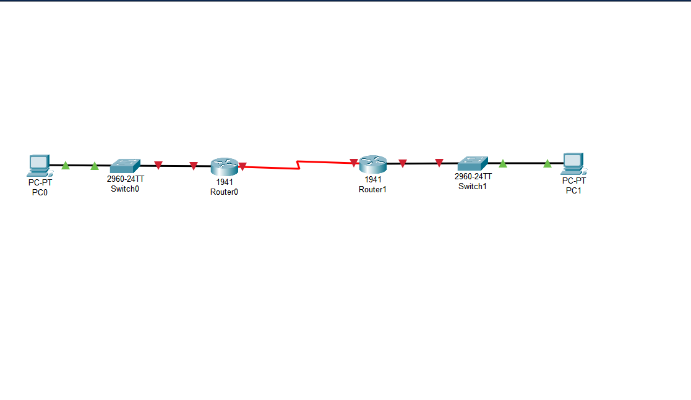
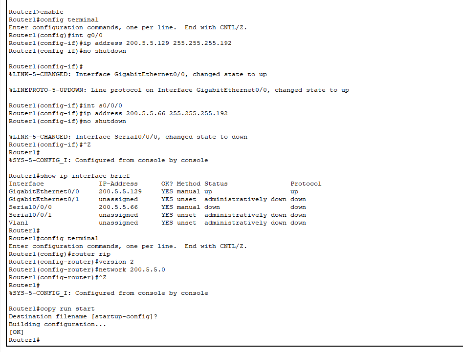

# Configuring IP Addresses and Routing — Cisco Packet Tracer

## 📄 Overview

This project simulates a basic routed network using Cisco Packet Tracer. It demonstrates the manual configuration of IP addresses, subnetting, static addressing on PCs, and dynamic routing with RIP version 2. The goal was to ensure full connectivity between end devices across multiple subnets.

---

## 🖼 Topology

The network consists of:

- 2 Routers (Router0 and Router1)
- 2 Switches (Switch0 and Switch1)
- 2 PCs (PC0 and PC1)

---

## ⚙️ Configuration Details

### 🔹 Router0

- **GigabitEthernet0/0:** `200.5.5.1` / `255.255.255.192`
- **Serial0/0/0:** `200.5.5.65` / `255.255.255.192`
- **RIP Routing:** Enabled (v2)

  

---

### 🔹 Router1

- **GigabitEthernet0/0:** `200.5.5.129` / `255.255.255.192`
- **Serial0/0/0:** `200.5.5.66` / `255.255.255.192`
- **RIP Routing:** Enabled (v2)

---

### 🖥 PC Configuration

#### PC0 (Left Side)
- **IP Address:** `200.5.5.2`
- **Subnet Mask:** `255.255.255.192`
- **Default Gateway:** `200.5.5.1`

#### PC1 (Right Side)
- **IP Address:** `200.5.5.130`
- **Subnet Mask:** `255.255.255.192`
- **Default Gateway:** `200.5.5.129`

---

## 🔁 Routing Protocol

Both routers were configured with RIP version 2 using the following network:

